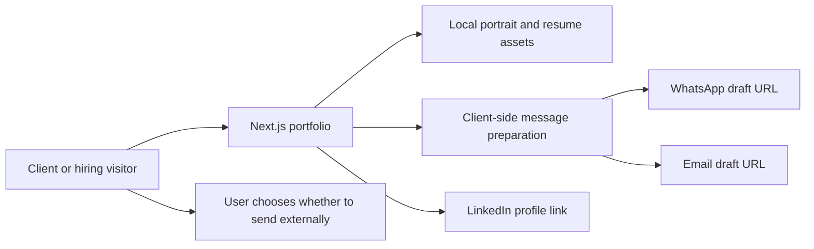
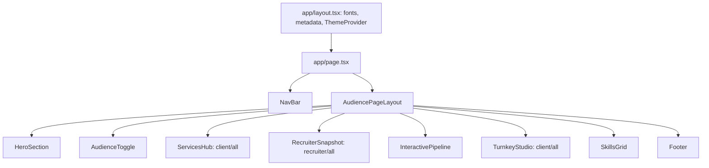

# System design

Date: 2026-10-07
Status: Current architecture recorded; proposed refinement preserves these boundaries.

## Context

There is no enquiry API, database, login or CMS. Current pages are intended for static rendering within a Next.js deployment. This is not a claim that the application uses static-export mode; Next.js image serving and configured headers remain part of the existing hosting setup. Vercel is described by project notes as the host, but the current connector has not been matched to this site's project.

## Page structure

ProjectShowcase source and project data exist but are not rendered. The name InteractivePipeline refers to the current delivery-process content, not a simulated system dashboard.

## Data and events

| Source | Responsibility |
| --- | --- |
| lib/data.ts | Personal/professional content and retained hidden-project data |
| lib/services.ts | Five business needs, fourteen scopes and handover information |
| lib/audience.ts | URL-driven mode, history subscription, section navigation |
| lib/project-planner.ts | Service-selection event contract |
| lib/contact.ts | Shared résumé URL and encoded external draft helpers |
| lib/estimate.ts | Pure illustrative time-value calculation |
| app/globals.css | Shared theme tokens, focus, controls and motion preference rules |

Service action -> portfolio:select-service event -> mounted TurnkeyStudio listener -> valid, deduplicated selection -> retained note/draft generation. Navigation uses portfolio:navigate plus popstate/hashchange subscriptions. Preserve event names and ordering during visual changes.

## Technical baseline

Installed on 2026-10-07: Node 24.15.0; npm 11.12.1; Next.js 16.3.8; React/React DOM 19.2.3; Tailwind CSS 4.1.18; Motion 13.4.4; TypeScript 5.9.3; next-themes 0.4.6; lucide-react 0.563.0. Existing Radix dialog/tabs/tooltip primitives and local UI components support interactions.

npm ls reported six extraneous optional/WASM packages alongside installed direct dependencies. This is a baseline hygiene finding, not proof of a broken build. Do not silently clean it up during design planning. Establish a reproducible installation if it prevents later verification.

## Refinement boundaries

Most implementation should live in existing presentation components and CSS. Keep current client/server boundaries unless a specific verified need arises. Keep business calculations and draft helpers out of visual effects. MCPs and skills are authoring-time tools; visitors never depend on a component-registry MCP to load the website.

No new architecture is proposed. Any future backend, persistence, CMS, analytics or hosting change needs its own scope and an authorized superseding ADR; do not rewrite existing ADR history.

## Delivery and privacy

Local public assets remain served through existing paths. Existing security headers and metadata/sitemap/robots conventions remain intact. No new runtime scripts, tracking, external image hotlinks or credentials are required. Copied components must not introduce hidden telemetry.

The planning packet can remain in the repository; it contains public product facts and non-sensitive technical observations. Private vault notes, account identifiers, tokens and unrelated connected-service data must not be included in public delivery. The ignored .brain junction stays private.
