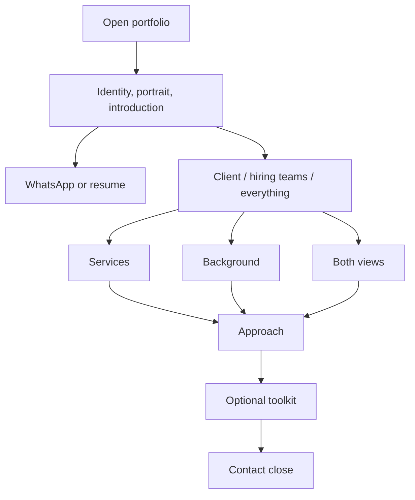
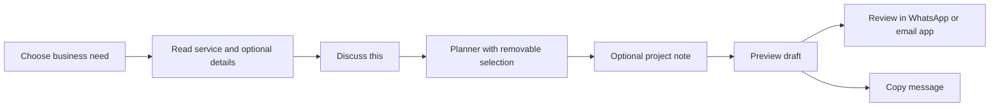
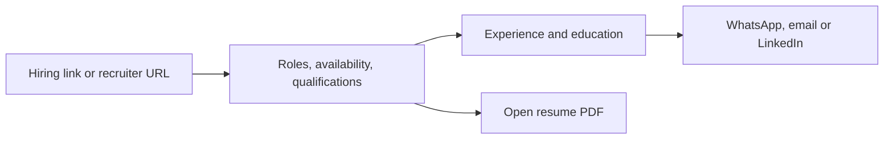

# User journeys and state flows

Date: 2026-10-07
Status: Current behavior to preserve; diagrams are logical flows, not proposed extra screens.

## Shared entry

Default mode is client. Direct section links can reveal the required view. The client/all path also includes the optional planner after Approach. Hiring mode hides the planner. Navigation does not require the visitor to complete the page sequence.

## Client: service-led enquiry

Selecting a service adds it once, switches the planner to scope mode, folds optional goals/starting point and navigates to the planner. Existing notes, tools, timing and other selections survive. Another service can be added; each can be removed. Modified clicks retain native link behavior and do not silently populate a new tab's planner.

## Client: problem-led enquiry

The visitor can use Help me define the project, describe a custom problem, select goals without a service, leave all fields blank, or use direct WhatsApp. Fields are optional; an estimate is never a required gate. A goal implied by a service is represented consistently. Removing an implied need also removes its service selections according to current behavior.

## Hiring

Keep junior/associate opportunities visible. Do not insert an animation, carousel or modal before the résumé. Certificates remain a disclosure; work history remains readable in document order.

## State contract

| State | Owner | Lifetime | Important behavior |
| --- | --- | --- | --- |
| Audience | lib/audience.ts | URL query/hash and browser history | Client/recruiter/all; back/forward and deep links |
| Theme | next-themes | Existing provider preference | System/light/dark; verify on refresh |
| Catalogue category | ServicesHub state | Mounted page session | Survives audience changes |
| Selected services and goals | TurnkeyStudio state | Mounted page session | Deduplicated; removable; retained |
| Draft fields | TurnkeyStudio state | Mounted page session | No automatic storage or transmission; refresh clears |
| Planner/estimate tab and inputs | TurnkeyStudio state | Mounted page session | Retained when audience changes |
| Disclosure expansion | Native details/controlled brief | Existing mounted-element lifetime | Keyboard operable; focus remains meaningful |

Both audience views must stay mounted. Styling or animation must not key/remount them when switching views.

## Recovery and edge cases

- Back/forward restores URL-based audience and section context.
- #dossier reveals hiring; #services and #studio reveal client unless everything is explicitly requested. Unknown view values fall back through the existing URL rules.
- Reduced motion uses instant scrolling and omits movement; target focus still occurs.
- Clipboard denial shows the existing failure message and leaves preview/external links usable.
- External apps may be unavailable; the message preview and copy affordance remain available.
- Mobile menu closes with Escape and returns focus according to current implementation.
- Sticky navigation must not obscure anchor targets or focused controls.
- Refresh clearing the draft is current behavior, not a bug to fix by adding persistence during this visual pass.

Opening an external draft is not evidence that a message was sent. QA must not send messages.
